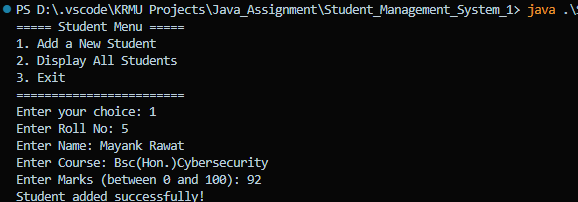
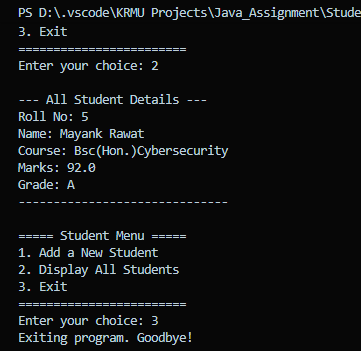

# Student Record Management System

### Project Overview
This is a command-line application for a college lab assignment that demonstrates basic object-oriented programming in Java. The program allows for the creation and display of student records, including the automatic calculation of grades from marks.

***

### Features
* **Add Student**: Allows the user to enter and store a student's Roll Number, Name, Course, and Marks.
* **Display Students**: Shows a complete list of all student records currently stored in the system.
* **Grade Calculation**: Automatically computes a letter grade based on the student's marks.
* **Input Validation**: Includes a basic check to ensure student marks are within the valid 0-100 range.

***

### Code Structure
The program is contained within a single `StudentSystem.java` file and uses two classes:
* **`Student` Class**: A blueprint that holds the data for each student (Roll Number, Name, etc.). It also contains the logic for grade calculation and displaying details.
* **`StudentSystem` Class**: The primary class that runs the application. It contains the `main` method, handles the user menu, and manages the array of student objects.

### Output 
 
 